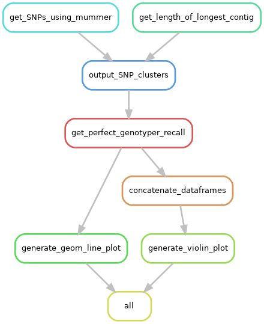

# About

Plots how good would be a 100% sensitivity single genome caller to call variants in a pangenome.

# Dependencies

```
Snakemake 5
conda
```

Install the following dependencies:
```
conda install python=3.7 bwa mummer
pip install networkx biopython pysam
```

# Rulegraph


